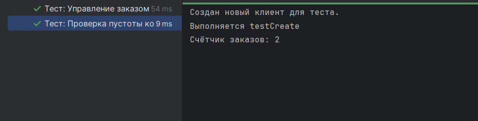
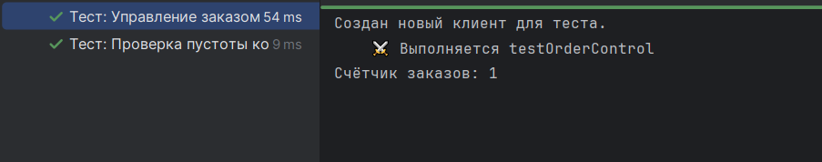
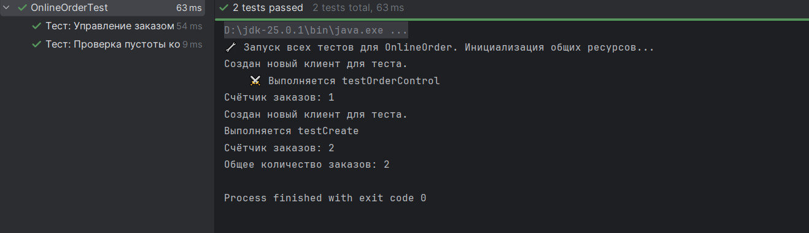
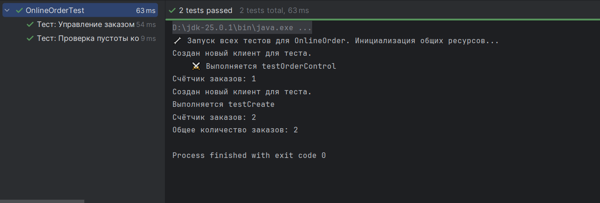
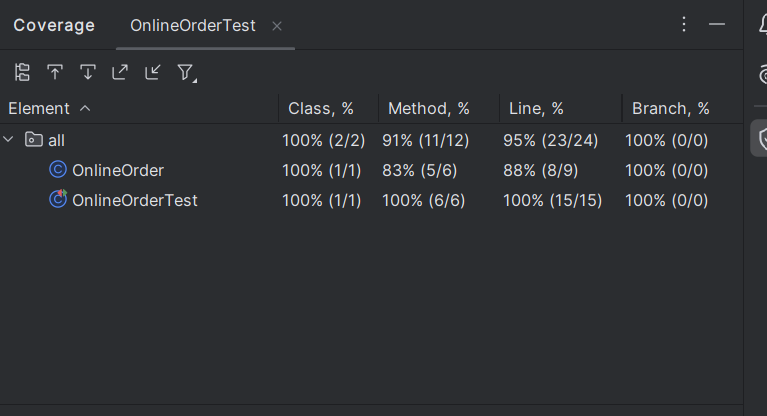

# Лабораторная работа №2_1: Тестовое окружение в JUnit

## 👨‍🎓 Студент
- **ФИО:** Рябов Александр Евгеньевич
- **Группа:** 247
- **Вариант:** 16 (Онлайн-заказ)

---

## ✅ Выполненные задания

### Задание 1 (Простое)
**Тест:** Проверка создания клиента

### Задание 2 (Среднее)
**Тесты:** 
- проверка добавления предмета
- проверка отметки о доставке

### Задание 3 (Сложное)
**Тест:** Проверка статического счетчика операций

---

## 📊 Результаты

---

## 📎 Ссылки
- [Код тестов](src/OnlineOrderTest.java)
- [Основной класс](src/OnlineOrder.java)

*Дата: 22.06.2026*
